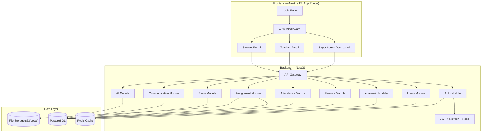
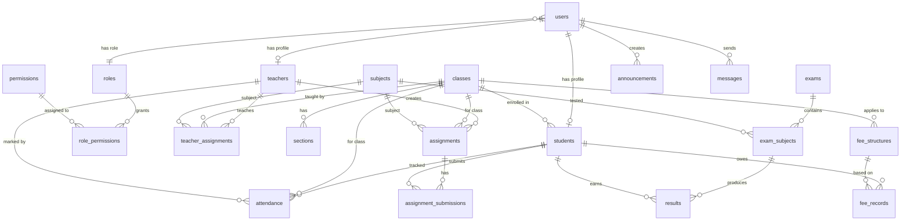
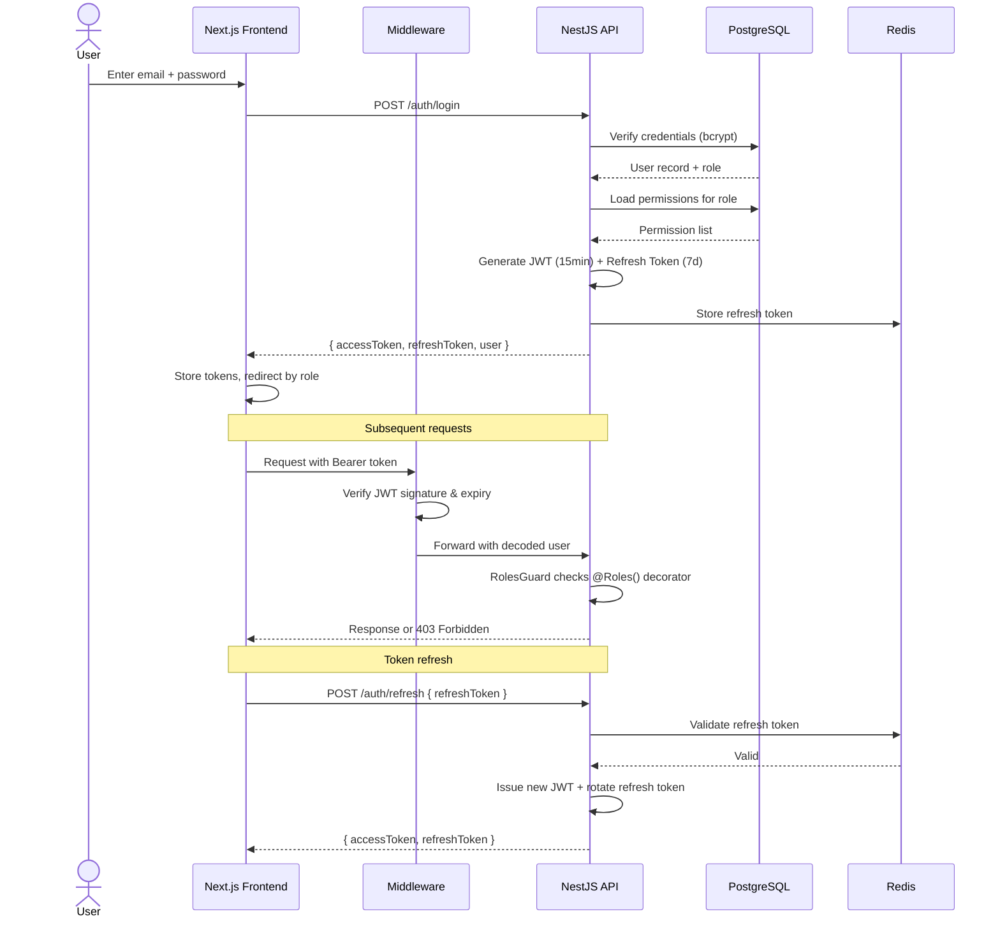

# EduERP — School Enterprise Resource Planning System

A comprehensive School ERP with strict three-tier RBAC (Super Admin → Teacher → Student), built as a production-grade, full-stack TypeScript monorepo.

---

## User Review Required

> [!IMPORTANT]
> **Scope is massive.** This plan covers 8 phases. I recommend we build Phase 1–3 first (auth, core entities, dashboards) and demo before continuing. Please confirm you want the **full plan executed sequentially** or prefer an **MVP-first** approach.

> [!WARNING]
> **Tech stack decisions that affect everything downstream:**
> - **ORM**: Plan uses **Drizzle ORM** (better perf, closer to SQL, lighter than Prisma). Switch to Prisma if you prefer.
> - **State Management**: Plan uses **Zustand** (simpler than Redux Toolkit for this use case). Switch to Redux Toolkit if you prefer.
> - **Package Manager**: Plan uses **pnpm** with Turborepo monorepo. Confirm this is acceptable.

> [!CAUTION]
> **AI features (Phase 7)** require API keys for an LLM service (OpenAI/Gemini). These will incur costs. Confirm you want them included or deferred.

---

## Open Questions

1. **Deployment target** — Are you deploying to AWS, GCP, Vercel, or running locally for now?
2. **Multi-tenancy** — Is this for a single school or should it support multiple schools (SaaS model)?
3. **Email/SMS** — Do you have a provider preference (SendGrid, Twilio, etc.) for notifications?
4. **Payment gateway** — For fee collection, do you need Razorpay, Stripe, or skip payments for now?
5. **AI Provider** — OpenAI (GPT) or Google Gemini for AI features?
6. **Super Admin seed** — Should the first Super Admin be created via a seed script or a registration page?

---

## System Architecture Overview



---

## Monorepo Structure

```
EduERP/
├── apps/
│   ├── web/                          # Next.js 15 frontend
│   │   ├── src/
│   │   │   ├── app/
│   │   │   │   ├── (auth)/           # Login, forgot password
│   │   │   │   ├── (dashboard)/
│   │   │   │   │   ├── admin/        # Super Admin pages
│   │   │   │   │   ├── teacher/      # Teacher pages
│   │   │   │   │   └── student/      # Student pages
│   │   │   │   ├── layout.tsx
│   │   │   │   └── page.tsx          # Landing / redirect
│   │   │   ├── components/
│   │   │   │   ├── ui/               # ShadCN components
│   │   │   │   ├── charts/           # Dashboard chart components
│   │   │   │   ├── forms/            # Reusable form components
│   │   │   │   ├── layout/           # Sidebar, Navbar, etc.
│   │   │   │   └── shared/           # DataTable, Modals, etc.
│   │   │   ├── hooks/                # Custom React hooks
│   │   │   ├── lib/                  # Utilities, API client, auth helpers
│   │   │   ├── stores/               # Zustand stores
│   │   │   └── styles/               # Global CSS, design tokens
│   │   ├── public/
│   │   ├── next.config.ts
│   │   ├── tailwind.config.ts
│   │   └── package.json
│   │
│   └── api/                          # NestJS backend
│       ├── src/
│       │   ├── modules/
│       │   │   ├── auth/             # Login, JWT, guards, strategies
│       │   │   ├── users/            # User CRUD, role assignment
│       │   │   ├── teachers/         # Teacher-specific logic
│       │   │   ├── students/         # Student-specific logic
│       │   │   ├── classes/          # Class & section management
│       │   │   ├── subjects/         # Subject management
│       │   │   ├── attendance/       # Attendance marking & reports
│       │   │   ├── assignments/      # Assignment CRUD & submissions
│       │   │   ├── exams/            # Exam creation & results
│       │   │   ├── fees/             # Fee structure & payments
│       │   │   ├── communication/    # Announcements & messaging
│       │   │   └── ai/              # AI prediction & assistant
│       │   ├── common/
│       │   │   ├── guards/           # JwtAuthGuard, RolesGuard
│       │   │   ├── decorators/       # @Roles(), @CurrentUser()
│       │   │   ├── interceptors/     # Logging, transform
│       │   │   ├── filters/          # Exception filters
│       │   │   └── pipes/            # Validation pipes
│       │   ├── database/
│       │   │   ├── schema/           # Drizzle schema files
│       │   │   ├── migrations/       # SQL migrations
│       │   │   └── seeds/            # Seed data
│       │   ├── config/               # Environment config
│       │   ├── app.module.ts
│       │   └── main.ts
│       ├── drizzle.config.ts
│       └── package.json
│
├── packages/
│   └── shared/                       # Shared types, enums, validators
│       ├── src/
│       │   ├── types/                # TypeScript interfaces
│       │   ├── enums/                # Role, Permission enums
│       │   ├── validators/           # Zod schemas
│       │   └── constants/            # Shared constants
│       └── package.json
│
├── turbo.json
├── pnpm-workspace.yaml
├── package.json
├── .env.example
├── docker-compose.yml                # PostgreSQL + Redis
└── README.md
```

---

## Proposed Changes — Phase-by-Phase

---

### Phase 1: Foundation & Authentication (Week 1–2)

This phase establishes the monorepo, database, and the entire auth system. Everything else depends on this.

---

#### [NEW] Root monorepo config

- `package.json` — Root workspace config
- `pnpm-workspace.yaml` — Workspace definition
- `turbo.json` — Turborepo pipeline config
- `.env.example` — Environment variable template
- `docker-compose.yml` — PostgreSQL 16 + Redis 7

#### [NEW] `packages/shared/` — Shared types & enums

| File | Purpose |
|------|---------|
| `src/enums/roles.ts` | `Role` enum: `SUPER_ADMIN`, `TEACHER`, `STUDENT` |
| `src/enums/permissions.ts` | Granular permissions: `CREATE_TEACHER`, `MARK_ATTENDANCE`, `VIEW_OWN_RESULTS`, etc. |
| `src/types/user.ts` | `User`, `TokenPayload`, `LoginRequest`, `LoginResponse` interfaces |
| `src/validators/auth.ts` | Zod schemas for login, registration validation |
| `src/constants/index.ts` | API routes, pagination defaults |

#### [NEW] `apps/api/` — NestJS backend scaffolding

| File | Purpose |
|------|---------|
| `src/main.ts` | Bootstrap NestJS, enable CORS, Swagger, validation pipe |
| `src/app.module.ts` | Root module importing all feature modules |
| `src/config/env.config.ts` | Typed environment config using `@nestjs/config` |
| `src/database/schema/users.ts` | Drizzle schema: `users`, `roles`, `permissions`, `role_permissions` tables |
| `src/database/schema/index.ts` | Schema barrel export |
| `src/database/migrations/` | Initial migration for auth tables |
| `src/database/seeds/seed.ts` | Seed Super Admin + default roles + permissions |

#### [NEW] `apps/api/src/modules/auth/` — Authentication module

| File | Purpose |
|------|---------|
| `auth.module.ts` | Module definition |
| `auth.controller.ts` | `POST /auth/login`, `POST /auth/refresh`, `POST /auth/logout` |
| `auth.service.ts` | Credential validation, JWT signing, refresh token rotation |
| `strategies/jwt.strategy.ts` | Passport JWT strategy |
| `strategies/local.strategy.ts` | Passport local strategy |
| `dto/login.dto.ts` | Login request DTO with validation |

#### [NEW] `apps/api/src/common/` — Guards & decorators

| File | Purpose |
|------|---------|
| `guards/jwt-auth.guard.ts` | Authenticates requests via JWT |
| `guards/roles.guard.ts` | Authorizes based on `@Roles()` decorator metadata |
| `decorators/roles.decorator.ts` | `@Roles(Role.SUPER_ADMIN, Role.TEACHER)` |
| `decorators/current-user.decorator.ts` | `@CurrentUser()` extracts user from request |
| `decorators/permissions.decorator.ts` | `@RequirePermissions('mark_attendance')` |
| `filters/http-exception.filter.ts` | Standardized error responses |
| `interceptors/transform.interceptor.ts` | Wraps responses in `{ success, data, message }` |

#### [NEW] `apps/web/` — Next.js 15 frontend scaffolding

| File | Purpose |
|------|---------|
| `src/app/layout.tsx` | Root layout with font loading (Inter), theme provider |
| `src/app/page.tsx` | Landing page → redirect to login |
| `src/app/(auth)/login/page.tsx` | Login page with role-aware routing |
| `src/app/(auth)/forgot-password/page.tsx` | Password recovery |
| `src/lib/api-client.ts` | Axios instance with interceptors for JWT |
| `src/lib/auth.ts` | Auth helpers: `getSession()`, `isAuthenticated()` |
| `src/stores/auth-store.ts` | Zustand store for auth state |
| `src/middleware.ts` | Next.js middleware for route protection & role redirect |
| `src/styles/globals.css` | Design tokens, CSS variables, base styles |
| `tailwind.config.ts` | Custom color palette, font family, animations |

---

### Phase 2: User Management & Core Entities (Week 3–4)

Build the admin's ability to manage teachers, students, classes, and subjects.

---

#### [NEW] `apps/api/src/database/schema/academics.ts` — Core entity schemas

```
Tables: teachers, students, classes, sections, subjects,
        class_subjects, teacher_assignments (which teacher teaches which class+subject)
```

#### [NEW] `apps/api/src/modules/users/` — User management

| Endpoint | Role | Description |
|----------|------|-------------|
| `GET /users` | SUPER_ADMIN | List all users with pagination, search, filter |
| `POST /users` | SUPER_ADMIN | Create user (teacher or student) |
| `PATCH /users/:id` | SUPER_ADMIN | Update user profile |
| `DELETE /users/:id` | SUPER_ADMIN | Soft-delete / suspend user |
| `PATCH /users/:id/role` | SUPER_ADMIN | Change user role |

#### [NEW] `apps/api/src/modules/teachers/` — Teacher management

| Endpoint | Role | Description |
|----------|------|-------------|
| `GET /teachers` | SUPER_ADMIN | List teachers with department filter |
| `POST /teachers` | SUPER_ADMIN | Create teacher + user account |
| `GET /teachers/:id` | SUPER_ADMIN, TEACHER(self) | Get teacher profile |
| `PATCH /teachers/:id/assign` | SUPER_ADMIN | Assign classes & subjects |

#### [NEW] `apps/api/src/modules/students/` — Student management

| Endpoint | Role | Description |
|----------|------|-------------|
| `GET /students` | SUPER_ADMIN, TEACHER(own class) | List students |
| `POST /students` | SUPER_ADMIN | Enroll student |
| `PATCH /students/:id/promote` | SUPER_ADMIN | Promote to next class |
| `PATCH /students/:id/transfer` | SUPER_ADMIN | Transfer section/class |

#### [NEW] `apps/api/src/modules/classes/` — Class & subject management

| Endpoint | Role | Description |
|----------|------|-------------|
| `GET /classes` | ALL | List classes |
| `POST /classes` | SUPER_ADMIN | Create class with sections |
| `POST /subjects` | SUPER_ADMIN | Create subject |
| `POST /classes/:id/assign-teacher` | SUPER_ADMIN | Assign teacher to class |

#### [NEW] Frontend: Admin user management pages

| Page | Features |
|------|----------|
| `admin/users/page.tsx` | DataTable with search, filter, bulk actions |
| `admin/users/[id]/page.tsx` | User detail/edit form |
| `admin/teachers/page.tsx` | Teacher list with assignment management |
| `admin/students/page.tsx` | Student list with enrollment & promotion |
| `admin/classes/page.tsx` | Class/section/subject configuration |

---

### Phase 3: Dashboards & Navigation (Week 5–6)

Build the three role-specific dashboards with KPI cards, charts, quick actions, and sidebar navigation.

---

#### [NEW] `apps/web/src/components/layout/`

| Component | Description |
|-----------|-------------|
| `sidebar.tsx` | Collapsible sidebar with role-based menu items |
| `navbar.tsx` | Top bar with user avatar, notifications bell, search |
| `dashboard-layout.tsx` | Wraps sidebar + navbar + content area |
| `breadcrumb.tsx` | Dynamic breadcrumb navigation |

#### [NEW] Super Admin Dashboard — `admin/page.tsx`

**KPI Cards (top row):**
| Card | Data |
|------|------|
| Total Students | Count from `students` table |
| Total Teachers | Count from `teachers` table |
| Attendance % | Today's average across all classes |
| Fee Collection (MTD) | Sum of paid fees this month |
| Pending Fees | Sum of unpaid/overdue fees |
| New Admissions (MTD) | Students enrolled this month |

**Charts:**
- Student enrollment growth (line chart, 12 months)
- Revenue trend (bar chart, 12 months)
- Attendance trend (area chart, 30 days)
- Class-wise performance (horizontal bar chart)

**Quick Actions:** Add Student, Add Teacher, Generate Report, Create Notice, Manage Fees

#### [NEW] Teacher Dashboard — `teacher/page.tsx`

**Summary Cards:**
| Card | Data |
|------|------|
| Classes Today | From timetable for current day |
| Pending Assignments | Ungraded submissions count |
| Attendance Pending | Classes not yet marked today |
| Unread Messages | Count from communication module |

**Quick Actions:** Mark Attendance, Create Assignment, Upload Notes, Enter Marks, Send Announcement

#### [NEW] Student Dashboard — `student/page.tsx`

**Overview Cards:**
| Card | Data |
|------|------|
| Attendance % | Personal attendance rate |
| Current GPA | Calculated from latest results |
| Pending Assignments | Due assignments count |
| Upcoming Exams | Next exam with countdown |

**Quick Actions:** Submit Assignment, View Timetable, Download Notes, Check Results

---

### Phase 4: Attendance Module (Week 7–8)

---

#### [NEW] `apps/api/src/modules/attendance/`

| Endpoint | Role | Description |
|----------|------|-------------|
| `POST /attendance/mark` | TEACHER | Mark attendance for a class (batch) |
| `PATCH /attendance/:id` | TEACHER | Edit attendance record |
| `GET /attendance/class/:classId` | TEACHER, SUPER_ADMIN | Class attendance history |
| `GET /attendance/student/:studentId` | ALL (scoped) | Student attendance history |
| `GET /attendance/report` | SUPER_ADMIN | School-wide attendance analytics |

#### [NEW] `apps/api/src/database/schema/attendance.ts`

```
attendance: id, student_id, class_id, subject_id, date, status (PRESENT/ABSENT/LATE/EXCUSED), marked_by, created_at
```

#### [NEW] Frontend attendance pages

| Page | Role | Features |
|------|------|----------|
| `teacher/attendance/page.tsx` | Teacher | Class selector → student list → mark present/absent/late |
| `teacher/attendance/history/page.tsx` | Teacher | Calendar view of past attendance |
| `admin/attendance/page.tsx` | Admin | School-wide attendance analytics with charts |
| `student/attendance/page.tsx` | Student | Personal attendance calendar (read-only) |

---

### Phase 5: Assignments & Exams (Week 9–12)

---

#### [NEW] `apps/api/src/modules/assignments/`

| Endpoint | Role | Description |
|----------|------|-------------|
| `POST /assignments` | TEACHER | Create assignment with file upload |
| `GET /assignments` | TEACHER, STUDENT (scoped) | List assignments |
| `POST /assignments/:id/submit` | STUDENT | Upload submission |
| `PATCH /assignments/:id/grade` | TEACHER | Grade a submission |
| `GET /assignments/:id/submissions` | TEACHER | View all submissions for an assignment |

#### [NEW] `apps/api/src/modules/exams/`

| Endpoint | Role | Description |
|----------|------|-------------|
| `POST /exams` | SUPER_ADMIN | Create exam schedule |
| `POST /exams/:id/results` | TEACHER | Enter results (batch) |
| `GET /exams/:id/results` | ALL (scoped) | View results |
| `GET /exams/report-card/:studentId` | SUPER_ADMIN, STUDENT(self) | Generate report card |

#### [NEW] Database schemas

```
assignments: id, teacher_id, class_id, subject_id, title, description, file_url, deadline, created_at
assignment_submissions: id, assignment_id, student_id, file_url, submitted_at, grade, feedback, graded_by, graded_at
exams: id, name, class_id, exam_type (MID_TERM/FINAL/UNIT_TEST), start_date, end_date
exam_subjects: id, exam_id, subject_id, date, max_marks
results: id, exam_subject_id, student_id, marks_obtained, grade, remarks
```

#### [NEW] Frontend pages

| Page | Role | Features |
|------|------|----------|
| `teacher/assignments/page.tsx` | Teacher | Create, list, manage assignments |
| `teacher/assignments/[id]/submissions/page.tsx` | Teacher | View & grade submissions |
| `teacher/exams/page.tsx` | Teacher | Enter marks for assigned exams |
| `student/assignments/page.tsx` | Student | View assignments, upload submissions |
| `student/results/page.tsx` | Student | View results, GPA chart |
| `admin/exams/page.tsx` | Admin | Create exam schedule, view results |
| `admin/reports/report-card/page.tsx` | Admin | Generate & print report cards |

---

### Phase 6: Finance Module (Week 13–15)

---

#### [NEW] `apps/api/src/modules/fees/`

| Endpoint | Role | Description |
|----------|------|-------------|
| `POST /fees/structure` | SUPER_ADMIN | Define fee structure per class |
| `GET /fees/students/:studentId` | SUPER_ADMIN, STUDENT(self) | View fee status |
| `POST /fees/payment` | SUPER_ADMIN | Record payment |
| `GET /fees/report` | SUPER_ADMIN | Fee collection analytics |
| `GET /fees/due` | SUPER_ADMIN | List overdue fees |

#### [NEW] Database schema

```
fee_structures: id, class_id, name (Tuition/Lab/Transport), amount, frequency (MONTHLY/QUARTERLY/ANNUAL)
fee_records: id, student_id, fee_structure_id, amount, due_date, paid_date, status (PAID/PENDING/OVERDUE), payment_method, transaction_id
expenses: id, category (SALARY/UTILITIES/MAINTENANCE), description, amount, date, approved_by
```

#### [NEW] Frontend pages

| Page | Role | Features |
|------|------|----------|
| `admin/finance/fees/page.tsx` | Admin | Fee structure management |
| `admin/finance/collection/page.tsx` | Admin | Payment recording, receipt generation |
| `admin/finance/expenses/page.tsx` | Admin | Expense tracking |
| `admin/finance/reports/page.tsx` | Admin | Revenue vs. expense charts |
| `student/fees/page.tsx` | Student | View fee status, download receipts |

---

### Phase 7: Communication & AI Features (Week 16–18)

---

#### [NEW] `apps/api/src/modules/communication/`

| Endpoint | Role | Description |
|----------|------|-------------|
| `POST /announcements` | SUPER_ADMIN, TEACHER | Create announcement |
| `GET /announcements` | ALL (scoped) | View announcements |
| `POST /messages` | ALL | Send direct message |
| `GET /messages` | ALL | Get inbox |

#### [NEW] `apps/api/src/modules/ai/`

| Feature | Endpoint | Description |
|---------|----------|-------------|
| Performance Predictor | `GET /ai/predict/:studentId` | Risk of failure based on attendance + grades |
| Attendance Risk | `GET /ai/attendance-risk` | Students at risk of low attendance |
| Smart Reports | `POST /ai/generate-report` | AI-summarized student performance |
| Chat Assistant | `POST /ai/chat` | Natural language Q&A about school data |

#### [NEW] Frontend pages

| Page | Role | Features |
|------|------|----------|
| `*/announcements/page.tsx` | All | View announcements |
| `admin/ai/insights/page.tsx` | Admin | AI dashboard with predictions |
| `teacher/ai/assistant/page.tsx` | Teacher | Generate question papers, lesson plans |
| `student/ai/assistant/page.tsx` | Student | Ask about schedule, grades, deadlines |

---

### Phase 8: Polish, Testing & Deployment (Week 19–20)

---

#### System-wide improvements

| Area | Tasks |
|------|-------|
| **Security** | 2FA for Super Admin, rate limiting, input sanitization, CSRF protection |
| **Performance** | Redis caching for dashboard KPIs, database query optimization, connection pooling |
| **Testing** | Unit tests for services, E2E tests for critical flows (login, attendance, grading) |
| **Audit Logging** | Log all CRUD operations on sensitive data (grades, fees, user changes) |
| **Responsive Design** | Mobile-friendly layouts for teacher attendance marking |
| **Swagger Docs** | Complete API documentation |
| **Docker** | Production Dockerfile for API + Web |
| **CI/CD** | GitHub Actions for lint, test, build |

---

## Database Schema (Complete ERD)



---

## RBAC Permission Matrix

| Permission | Super Admin | Teacher | Student |
|---|:---:|:---:|:---:|
| Manage Users (CRUD) | ✅ | ❌ | ❌ |
| Manage Classes & Subjects | ✅ | ❌ | ❌ |
| View All Financial Data | ✅ | ❌ | ❌ |
| Manage Fee Structures | ✅ | ❌ | ❌ |
| Record Payments | ✅ | ❌ | ❌ |
| Create Exams | ✅ | ❌ | ❌ |
| View School-wide Reports | ✅ | ❌ | ❌ |
| System Settings | ✅ | ❌ | ❌ |
| Mark Attendance (own class) | ❌ | ✅ | ❌ |
| Create Assignments (own class) | ❌ | ✅ | ❌ |
| Grade Submissions | ❌ | ✅ | ❌ |
| Enter Exam Marks | ❌ | ✅ | ❌ |
| View Own Class Students | ❌ | ✅ | ❌ |
| Send Class Announcements | ❌ | ✅ | ❌ |
| View Own Attendance | ❌ | ❌ | ✅ |
| View Own Results | ❌ | ❌ | ✅ |
| Submit Assignments | ❌ | ❌ | ✅ |
| View Own Fee Status | ❌ | ❌ | ✅ |
| View Timetable | ❌ | ✅ | ✅ |
| View Announcements | ✅ | ✅ | ✅ |
| Send Messages | ✅ | ✅ | ✅ |

---

## Authentication Flow



---

## UI Design System

### Color Palette

| Token | Value | Usage |
|-------|-------|-------|
| `--primary` | `hsl(222, 84%, 55%)` | Buttons, active states, links |
| `--primary-dark` | `hsl(222, 84%, 40%)` | Hover states |
| `--secondary` | `hsl(262, 80%, 60%)` | Accents, AI features |
| `--success` | `hsl(142, 76%, 42%)` | Positive metrics, present |
| `--warning` | `hsl(38, 92%, 55%)` | Pending, due soon |
| `--danger` | `hsl(0, 84%, 55%)` | Errors, absent, overdue |
| `--bg-dark` | `hsl(222, 47%, 11%)` | Dark mode background |
| `--bg-card` | `hsl(222, 47%, 14%)` | Card backgrounds |
| `--surface` | `hsl(222, 30%, 18%)` | Elevated surfaces |

### Typography

- **Font Family**: Inter (Google Fonts)
- **Headings**: 600–700 weight, tracking-tight
- **Body**: 400 weight, 1.6 line-height

### Component Style

- Glassmorphism cards with `backdrop-filter: blur(12px)`
- Subtle gradient borders on primary cards
- Smooth micro-animations (scale, opacity) on hover
- Dark mode by default with light mode toggle

---

## Verification Plan

### Automated Tests

```bash
# Backend unit tests
cd apps/api && pnpm test

# Backend E2E tests
cd apps/api && pnpm test:e2e

# Frontend build check
cd apps/web && pnpm build

# Full monorepo lint + type-check
pnpm turbo lint typecheck
```

**Critical E2E test scenarios:**
1. Login with each role → correct dashboard redirect
2. Teacher cannot access admin routes → 403
3. Student cannot access teacher routes → 403
4. Teacher marks attendance → data persists correctly
5. Student submits assignment → teacher sees submission
6. Super Admin creates user → user can login

### Manual Verification

- Browser testing of all three dashboards
- Verify role-based sidebar menu rendering
- Test JWT refresh flow (wait 15min for token expiry)
- Verify file upload for assignments
- Screenshot comparison of dashboard designs
